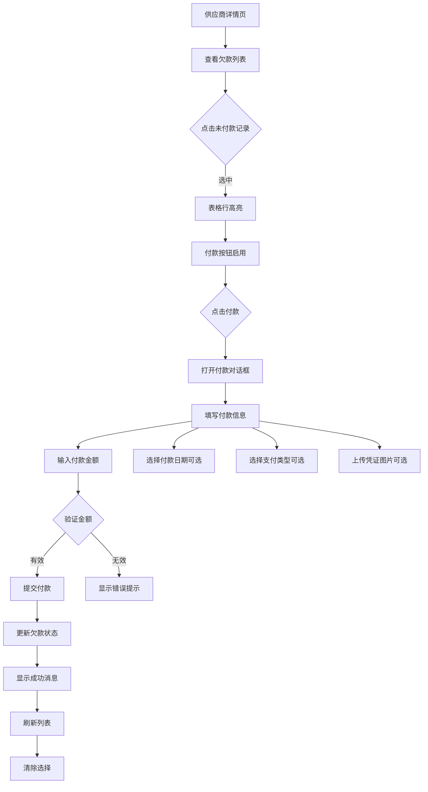

# 供应商付款功能优化说明

## 📋 更新概述

优化了供应商详情页面的付款功能，将付款按钮移至顶部操作栏，并增强了付款表单字段。

## 🎯 主要变更

### 1. UI布局调整

**变更前：**

```
┌─────────────────────────────────────────────┐
│  欠款明细        [添加欠款] [刷新]           │
│  ┌───────────────────────────────────────┐  │
│  │ 表格...                     [付款]    │  │
│  └───────────────────────────────────────┘  │
└─────────────────────────────────────────────┘
```

**变更后：**

```
┌─────────────────────────────────────────────┐
│  欠款明细  [添加欠款] [付款] [刷新]          │
│  ┌───────────────────────────────────────┐  │
│  │ 表格... (点击行选中)      [修改][删除]│  │
│  └───────────────────────────────────────┘  │
└─────────────────────────────────────────────┘
```

### 2. 付款交互流程

#### 新的操作流程：

1. **选择欠款记录** - 点击表格中的任意未付款记录（高亮显示）
2. **点击付款按钮** - 点击顶部的"付款"按钮（选中记录后才启用）
3. **填写付款信息** - 在弹出的对话框中填写付款详情
4. **确认付款** - 提交后更新欠款状态

#### 按钮状态：

- 未选择记录时：付款按钮**禁用**
- 选择已付款记录：弹出提示"该欠款已付款"
- 选择未付款记录：打开付款对话框

### 3. 增强的付款表单

#### 付款对话框字段：

| 字段         | 类型     | 必填 | 说明                               |
| ------------ | -------- | ---- | ---------------------------------- |
| **欠款金额** | 显示     | -    | 显示当前选中欠款的金额（红色加粗） |
| **付款金额** | 数字输入 | ✅   | 可输入≤欠款金额的值                |
| **付款日期** | 日期选择 | ❌   | 可选，默认为空                     |
| **支付类型** | 下拉选择 | ❌   | 可选"现金"或"承兑"                 |
| **上传凭证** | 图片上传 | ❌   | 支持JPG、PNG格式                   |

#### 表单验证规则：

```typescript
✓ 付款金额必须大于0
✓ 付款金额不能超过欠款金额
✓ 图片格式必须为 image/*
✓ 仅支持上传1张图片
```

### 4. 表格操作列优化

**变更前：** 宽度220px，包含3个按钮

- 付款（未付款时显示）
- 修改（未付款时显示）
- 删除

**变更后：** 宽度150px，包含2个按钮

- 修改（未付款时显示）
- 删除

## 📂 修改的文件

### 1. 前端页面

**文件：** `/src/views/supplier/detail.vue`

**主要变更：**

- ✅ 添加了`selectedDebt`状态管理选中的欠款记录
- ✅ 表格增加`highlight-current-row`和`@current-change`事件
- ✅ 顶部操作栏增加"付款"按钮（带禁用状态）
- ✅ 移除操作列中的"付款"按钮
- ✅ 新增`payDialogVisible`、`payForm`、`voucherFileList`等状态
- ✅ 新增`handleCurrentChange`、`handlePayClick`、`handlePaySubmit`等方法
- ✅ 新增图片上传处理：`handleVoucherUpload`、`handleVoucherRemove`
- ✅ 完整的付款对话框UI（包含表单验证）

**关键代码片段：**

```typescript
// 表格行选择
const handleCurrentChange = (row: SupplierDebt | null) => {
  selectedDebt.value = row;
};

// 付款表单
const payForm = reactive({
  paidAmount: 0,
  paymentDate: "",
  paymentType: "" as "" | "现金" | "承兑",
  voucher: ""
});

// 图片上传处理
const handleVoucherUpload: UploadProps["onChange"] = uploadFile => {
  if (uploadFile.raw) {
    const reader = new FileReader();
    reader.onload = e => {
      payForm.voucher = e.target?.result as string;
    };
    reader.readAsDataURL(uploadFile.raw);
  }
};
```

### 2. API接口

**文件：** `/src/api/supplier.ts`

**变更：**

```typescript
// 修改前
export const paySupplierDebt = (
  debtId: number,
  data: { paidAmount: number }
) => { ... }

// 修改后
export const paySupplierDebt = (
  debtId: number,
  data: {
    paidAmount: number;
    paymentDate?: string;       // 新增
    paymentType?: "现金" | "承兑"; // 新增
    voucher?: string;           // 新增（Base64图片）
  }
) => { ... }
```

### 3. Mock数据

**文件：** `/mock/supplier.ts`

**变更：**

```typescript
// 接收并处理新的付款参数
const { paidAmount, paymentDate, paymentType, voucher } = body;

// 使用付款日期（如果提供）
debt.paidTime = paymentDate || new Date().toISOString();

// 返回信息包含支付类型
let message = `付款成功，已付 ¥${paidAmount.toFixed(2)}`;
if (paymentType) {
  message += `（${paymentType}）`;
}
```

## 🎨 UI/UX 改进

### 1. 交互优化

- ✨ **单选高亮** - 点击表格行时高亮显示，直观显示当前选中的记录
- ✨ **按钮状态** - 付款按钮根据选择状态自动启用/禁用
- ✨ **智能默认值** - 付款金额自动填充为欠款金额
- ✨ **清晰提示** - 欠款金额在对话框中红色加粗显示

### 2. 表单体验

- 📅 **日期选择器** - 可选择付款日期，默认为空
- 🏷️ **支付类型** - 下拉选择，支持清除
- 🖼️ **图片预览** - 图片卡片式上传，支持预览和删除
- ✅ **实时验证** - 付款金额超限时立即提示

### 3. 视觉优化

- 欠款金额：大号红色加粗文字
- 付款按钮：绿色主题（`type="success"`）
- 操作列宽度：220px → 150px（更紧凑）

## 🔄 业务流程



## 📸 功能截图说明

### 1. 顶部操作栏

```
┌─────────────────────────────────────────────┐
│ 欠款明细                                     │
│ [+ 添加欠款] [💰 付款] [🔄 刷新]             │
│          ↑ 未选中时禁用                       │
└─────────────────────────────────────────────┘
```

### 2. 付款对话框

```
┌────────── 付款 ──────────┐
│ 欠款金额                  │
│ ¥5,000.00 (红色加粗)      │
│                          │
│ 付款金额 *                │
│ [ 5000.00 ]              │
│                          │
│ 付款日期                  │
│ [ 选择日期... ]           │
│                          │
│ 支付类型                  │
│ [ 现金 / 承兑 ▼ ]        │
│                          │
│ 上传凭证                  │
│ [📷 图片上传]             │
│                          │
│     [取消]  [确定付款]     │
└──────────────────────────┘
```

## ⚠️ 注意事项

1. **图片处理**
   - 前端将图片转换为Base64格式传输
   - 实际项目中建议改为文件上传到服务器，返回URL
   - 大图片可能导致请求体过大

2. **日期格式**
   - 前端格式：`YYYY-MM-DD`
   - 后端需按此格式处理

3. **支付类型**
   - 仅支持"现金"和"承兑"两种类型
   - 可根据业务需求扩展更多类型

4. **选择状态**
   - 付款成功后自动清除选择状态
   - 刷新页面后选择状态不保留

## 🚀 测试要点

### 功能测试

- [ ] 选择未付款记录，付款按钮启用
- [ ] 选择已付款记录，弹出"已付款"提示
- [ ] 付款金额超过欠款金额时，显示错误提示
- [ ] 付款金额≤0时，显示错误提示
- [ ] 不选择日期和支付类型，可正常提交
- [ ] 上传图片后，可预览和删除
- [ ] 付款成功后，欠款状态更新为"已付款"
- [ ] 付款成功后，统计数据正确更新

### UI测试

- [ ] 表格行点击后正确高亮
- [ ] 付款按钮禁用/启用状态正常
- [ ] 对话框表单布局美观
- [ ] 图片上传组件显示正常
- [ ] 响应式布局在移动端正常

## 📝 后续优化建议

1. **图片存储**
   - 改为文件上传，存储到OSS/CDN
   - 返回图片URL而非Base64

2. **凭证查看**
   - 在欠款列表中显示凭证图标
   - 点击可查看大图

3. **批量付款**
   - 支持多选记录
   - 批量生成付款单

4. **付款历史**
   - 记录付款操作日志
   - 支持查看付款凭证

5. **数据导出**
   - 导出付款记录Excel
   - 包含凭证图片

---

**文档版本：** 1.0.0  
**更新日期：** 2025-11-08  
**维护人员：** AI Assistant
