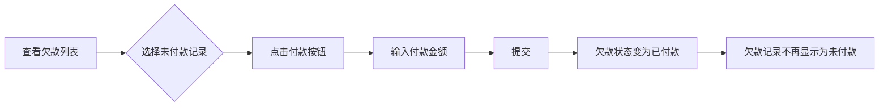
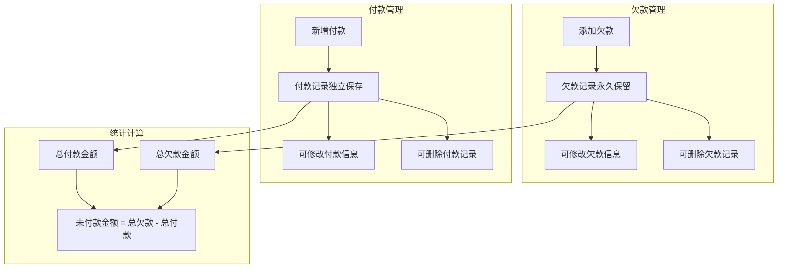

# 供应商欠款与付款分离业务逻辑说明

## 📋 业务逻辑变更概述

将供应商管理的业务逻辑从**"欠款状态切换"**改为**"欠款与付款独立记录"**，使其与客户管理模块保持一致。

## 🔄 核心业务逻辑变更

### ❌ 旧逻辑（已废弃）

```
欠款记录 = {
  id,
  amount,          // 欠款金额
  isPaid,          // 是否已付款（布尔值）
  paidAmount,      // 已付金额
  paidTime         // 付款时间
}

点击"付款" → 修改欠款记录的isPaid状态 → 欠款变为"已付款"
```

**问题：**

- ❌ 欠款和付款混在一起
- ❌ 只能记录一次付款
- ❌ 无法记录多次付款历史
- ❌ 无法分别修改欠款和付款信息

### ✅ 新逻辑（当前实现）

```
欠款记录 = {
  id,
  amount,          // 欠款金额
  description,     // 欠款描述
  // 不再有isPaid、paidAmount、paidTime
}

付款记录 = {
  id,
  amount,          // 付款金额
  paymentDate,     // 付款日期
  paymentType,     // 付款类型（现金/承兑）
  voucher,         // 付款凭证
  remark           // 备注
}

总应付款 = 总欠款金额 - 总付款金额
```

**优势：**

- ✅ 欠款和付款完全独立
- ✅ 可以记录任意多次付款
- ✅ 付款历史完整可追溯
- ✅ 欠款和付款都可以独立修改

## 🎯 页面功能说明

### 1️⃣ 统计卡片

显示两个核心指标：

| 指标           | 计算方式             | 颜色 |
| -------------- | -------------------- | ---- |
| **未付款金额** | 总欠款 - 总付款      | 橙色 |
| **已付款金额** | 所有付款记录金额总和 | 绿色 |

### 2️⃣ 欠款明细列表

**功能：**

- 显示所有欠款记录（永久保留，不会因为付款而消失）
- 添加欠款（支持上传Excel和图片附件）
- 修改欠款（金额和描述）
- 删除欠款

**字段：**

- ID
- 欠款金额（红色加粗）
- 欠款描述
- 附件（Excel/图片图标）
- 创建时间
- 操作（修改、删除）

**操作按钮：**

- 🔵 **添加欠款** - 新增一条欠款记录
- 🔄 **刷新** - 刷新所有数据

### 3️⃣ 付款记录列表

**功能：**

- 显示所有付款记录
- 新增付款（不需要选择欠款）
- 修改付款（所有字段都可修改）
- 删除付款

**字段：**

- ID
- 付款金额（绿色加粗）
- 付款日期
- 付款类型（Tag显示：现金/承兑）
- 凭证（图片图标）
- 备注
- 创建时间
- 操作（修改、删除）

**操作按钮：**

- 🟢 **新增付款** - 直接添加一条付款记录

## 📊 数据结构变更

### 1. API类型定义 (`/src/api/supplier.ts`)

#### 欠款明细类型（简化）

```typescript
export type SupplierDebt = {
  id: number;
  supplierId: number;
  amount: number; // 欠款金额
  description: string; // 欠款描述
  excelUrl?: string; // Excel文件URL
  imageUrl?: string; // 图片URL
  createTime: string;
  updateTime: string;
  // ❌ 移除：isPaid, paidAmount, paidTime
};
```

#### 付款记录类型（新增）

```typescript
export type PaymentType = "现金" | "承兑";

export type SupplierPayment = {
  id: number;
  supplierId: number;
  amount: number; // 付款金额
  paymentDate: string; // 付款日期
  paymentType: PaymentType; // 付款类型
  voucher?: string; // 付款凭证（Base64或URL）
  remark?: string; // 备注
  createTime: string;
  updateTime: string;
};
```

### 2. API接口变更

#### ❌ 删除的接口

```typescript
// 付款操作（已删除）
export const paySupplierDebt = (debtId, data) => { ... }
```

#### ✅ 新增的接口

```typescript
// 获取付款记录列表
export const getSupplierPaymentList = (supplierId: number) => { ... }

// 添加付款记录
export const addSupplierPayment = (data: {
  supplierId: number;
  amount: number;
  paymentDate: string;
  paymentType: PaymentType;
  voucher?: string;
  remark?: string;
}) => { ... }

// 修改付款记录
export const updateSupplierPayment = (data: SupplierPayment) => { ... }

// 删除付款记录
export const deleteSupplierPayment = (id: number) => { ... }
```

### 3. Mock数据变更 (`/mock/supplier.ts`)

#### 欠款数据生成（简化）

```typescript
const generateDebts = () => {
  // ... 生成欠款
  debts.push({
    id: debtId++,
    supplierId,
    amount,
    description,
    excelUrl,
    imageUrl,
    createTime,
    updateTime
    // ❌ 移除：isPaid, paidAmount, paidTime
  });
};
```

#### 付款数据生成（新增）

```typescript
const generatePayments = () => {
  // ... 生成付款记录
  payments.push({
    id: paymentId++,
    supplierId,
    amount,
    paymentDate,
    paymentType,
    voucher,
    remark,
    createTime,
    updateTime
  });
};
```

#### 总应付款计算逻辑（更新）

```typescript
// 旧逻辑
const calculateTotalPayable = supplierId => {
  const unpaidDebts = mockDebts.filter(
    d => d.supplierId === supplierId && !d.isPaid
  );
  return unpaidDebts.reduce((sum, debt) => sum + debt.amount, 0);
};

// ✅ 新逻辑
const calculateTotalPayable = supplierId => {
  const totalDebt = mockDebts
    .filter(d => d.supplierId === supplierId)
    .reduce((sum, debt) => sum + debt.amount, 0);

  const totalPaid = mockPayments
    .filter(p => p.supplierId === supplierId)
    .reduce((sum, payment) => sum + payment.amount, 0);

  return totalDebt - totalPaid;
};
```

## 🎨 UI布局变更

### 旧布局

```
┌──────────────────────────────────────────┐
│ 供应商详情                                │
├──────────────────────────────────────────┤
│ [统计卡片] 欠款总数/未付款/已付款          │
├──────────────────────────────────────────┤
│ 欠款明细列表                              │
│ ┌────────────────────────────────────┐   │
│ │ ID │金额│描述│状态│操作            │   │
│ │ 1  │5000│...│未付│[付款][修改][删除]│   │
│ │ 2  │3000│...│已付│[删除]          │   │
│ └────────────────────────────────────┘   │
└──────────────────────────────────────────┘
```

### ✅ 新布局

```
┌──────────────────────────────────────────┐
│ 供应商详情                                │
├──────────────────────────────────────────┤
│ [统计卡片] 未付款金额 / 已付款金额         │
├──────────────────────────────────────────┤
│ 欠款明细列表        [添加欠款][刷新]       │
│ ┌────────────────────────────────────┐   │
│ │ ID │金额│描述│附件│时间│操作      │   │
│ │ 1  │5000│...│📄 │...│[修改][删除]│   │
│ │ 2  │3000│...│📷 │...│[修改][删除]│   │
│ └────────────────────────────────────┘   │
├──────────────────────────────────────────┤
│ 付款记录列表        [新增付款]            │
│ ┌────────────────────────────────────┐   │
│ │ ID │金额│日期│类型│凭证│备注│操作 │   │
│ │ 1  │2000│...│现金│📷 │...│[修改][删除]│
│ │ 2  │1500│...│承兑│  │...│[修改][删除]│
│ └────────────────────────────────────┘   │
└──────────────────────────────────────────┘
```

## 🔄 业务流程对比

### 旧流程：付款修改欠款状态



**问题：**

- 欠款记录的状态被修改
- 如果需要记录多次付款，需要创建多条欠款
- 无法独立管理付款历史

### ✅ 新流程：欠款与付款独立管理



**优势：**

- 欠款和付款完全解耦
- 可以任意次数添加付款
- 历史记录完整清晰
- 修改和删除互不影响

## 🛠️ 修改的文件清单

| 文件路径                         | 修改内容                               | 类型     |
| -------------------------------- | -------------------------------------- | -------- |
| `/src/api/supplier.ts`           | 更新类型定义，添加付款记录API          | API接口  |
| `/mock/supplier.ts`              | 更新Mock数据生成，添加付款记录Mock API | Mock服务 |
| `/src/views/supplier/detail.vue` | 完全重写页面，分离欠款和付款列表       | 前端页面 |

## 📸 对话框功能说明

### 1. 添加欠款对话框

```
┌──────── 添加欠款 ────────┐
│ 欠款金额 *               │
│ [  0.00  ]              │
│                         │
│ 欠款描述 *               │
│ [多行文本输入]            │
│                         │
│ Excel文件                │
│ [选择Excel文件]          │
│                         │
│ 图片                     │
│ [📷 图片上传]            │
│                         │
│     [取消]  [确定]       │
└─────────────────────────┘
```

### 2. 修改欠款对话框

```
┌──────── 修改欠款 ────────┐
│ 欠款金额 *               │
│ [ 5000.00 ]             │
│                         │
│ 欠款描述 *               │
│ [多行文本输入]            │
│                         │
│     [取消]  [确定]       │
└─────────────────────────┘
```

### 3. 新增/修改付款对话框

```
┌──── 新增付款/修改付款 ────┐
│ 付款金额 *               │
│ [  0.00  ]              │
│                         │
│ 付款日期 *               │
│ [ 2025-11-08 ]          │
│                         │
│ 付款类型 *               │
│ [ 现金 / 承兑 ▼ ]       │
│                         │
│ 上传凭证                 │
│ [📷 图片上传]            │
│ 支持JPG、PNG格式          │
│                         │
│ 备注                     │
│ [多行文本输入]            │
│                         │
│  [取消]  [确定新增/修改]  │
└─────────────────────────┘
```

## ✅ 功能测试清单

### 欠款明细测试

- [ ] 添加欠款（仅必填字段）
- [ ] 添加欠款（包含Excel和图片附件）
- [ ] 修改欠款金额
- [ ] 修改欠款描述
- [ ] 删除欠款记录
- [ ] 欠款记录始终显示（不会因为付款而隐藏）

### 付款记录测试

- [ ] 新增付款（所有字段）
- [ ] 新增付款（仅必填字段）
- [ ] 修改付款金额
- [ ] 修改付款日期
- [ ] 修改付款类型
- [ ] 修改付款凭证
- [ ] 修改付款备注
- [ ] 删除付款记录

### 统计数据测试

- [ ] 未付款金额 = 总欠款 - 总付款
- [ ] 已付款金额 = 所有付款记录总和
- [ ] 添加欠款后统计数据更新
- [ ] 添加付款后统计数据更新
- [ ] 修改欠款后统计数据更新
- [ ] 修改付款后统计数据更新
- [ ] 删除欠款后统计数据更新
- [ ] 删除付款后统计数据更新

### UI交互测试

- [ ] 两个列表独立显示
- [ ] 按钮功能正确（添加欠款、新增付款）
- [ ] 对话框标题正确（新增/修改）
- [ ] 表单验证正确
- [ ] 成功提示显示
- [ ] 错误提示显示
- [ ] 刷新功能正常

## 🎯 业务场景示例

### 场景1：多次部分付款

```
1月1日：采购原材料，欠款10,000元
  → 添加欠款：10,000元（描述：原材料采购）

1月15日：第一次付款5,000元现金
  → 新增付款：5,000元（现金，上传凭证）

2月1日：第二次付款3,000元承兑
  → 新增付款：3,000元（承兑，上传凭证）

2月15日：第三次付款2,000元现金
  → 新增付款：2,000元（现金，上传凭证）

结果：
- 欠款列表：1条记录（10,000元）
- 付款列表：3条记录（5,000 + 3,000 + 2,000）
- 统计：未付款0元，已付款10,000元
```

### 场景2：付款超过欠款

```
欠款总计：50,000元
付款总计：55,000元

结果：
- 未付款金额：0元（不会显示负数）
- 已付款金额：55,000元
- 说明：多付了5,000元，可能是预付款
```

### 场景3：修改历史付款记录

```
发现付款记录有误：
- 原记录：5,000元，现金，2025-01-15
- 修改为：5,500元，承兑，2025-01-16

操作：
1. 点击付款记录的"修改"按钮
2. 修改金额、类型、日期
3. 保存后统计数据自动更新
```

## 🔮 未来扩展建议

### 1. 付款匹配功能

- 添加付款时可选择关联的欠款记录
- 显示付款与欠款的对应关系
- 自动计算每笔欠款的剩余未付金额

### 2. 对账功能

- 生成对账单（欠款明细 + 付款明细）
- 导出Excel对账报表
- 按日期范围筛选

### 3. 预警功能

- 超期未付款提醒
- 预付款余额提醒
- 大额欠款提醒

### 4. 批量操作

- 批量添加欠款（Excel导入）
- 批量添加付款（Excel导入）
- 批量删除功能

---

**文档版本：** 2.0.0  
**更新日期：** 2025-11-08  
**维护人员：** AI Assistant  
**变更类型：** 🔴 **重大业务逻辑变更**
